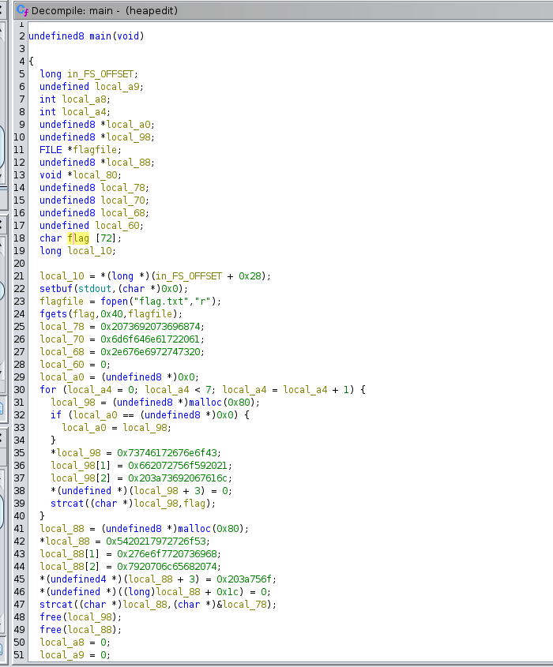

# [Cache Me Outside](https://play.picoctf.org/practice/challenge/146?category=6&page=1)

## Description
While being super relevant with my meme references, I wrote a program to see how much you understand heap allocations. `nc mercury.picoctf.net 17612`

## Attempts

### Attempt 1: Decompiling using Ghidra
Since the compiled file is provided (`heapedit`), we can decompile it and have a look at the code.

We see that the flag is loaded from a file on the server (`flag.txt`) and then read into a variable (`char flag [72]`)




We can also see that the size of the flag string (char[]) is 72, which is 9bytes, however, only 8 bytes (`0x40` = 64) are being read from the file (`fgets(flag, 0x40, flagfile)`). Maybe this is important, maybe not, who knows (I don't).

Then a huge bunch of pointer-arithmetic-shit is being done in a weird-ass loop, we won't bother with this one for now.

We can then also see `strcat((char *)local_98,flag)`

#### `man strcat`
`strcat(char *restrict dst, const char *restrict src)`

appends the content of `src` to the content of `dst`, basically in-place concatinating the dst-string with the src-string.

Now, the thing is, this stuff happens every loop iteration, we can see in the loop that this happens exactly 7 times.
So the contents of `local_98` now also contain our flag. Since `local_98` gets assigned a new address space in the heap (first line in the for-loop `local_98 = (undefined8*) malloc(0x80)`) I am assuming that we technically only care about the contents of `local_98` on the very last iteration, since this is then kept after the loop.
We can also see a bunch of weird-ass addresses being written to this variable, don't know what to do with this info tho.

On line 48 we have a `free(local_98)`, which iirc only marks this address-space as free, but the contents of it are still very much there, since nothing else seems to be directly overriding it nor did the contents of `local_98` get moved/copied to any other variable I assume that we could still read the flag from that address-space.

```
free()
    The  free()  function frees the memory space pointed to by ptr, which must have been returned by a
    previous call to malloc() or related functions.  Otherwise, or if ptr has already been freed,  un‐
    defined behavior occurs.  If ptr is NULL, no operation is performed.
```

# More Coming Soon
Binary Exploitation is great and all but this is too much guesswork for me, starting now - my bachelor's degree in Binary Exploitation with [pwn.com](https://pwn.com) as recommended by [this roadmap](https://www.hoppersroppers.org/roadmap/training/pwning.html)


